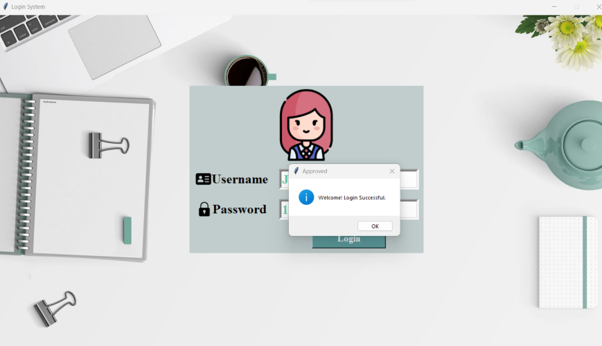
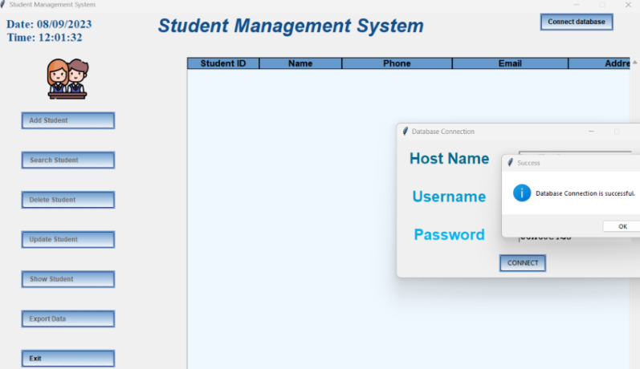
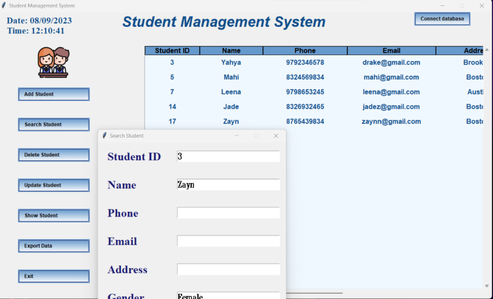

# Student-Management-System
A comprehensive Student Management System (SMS) web application built using Python's Tkinter GUI library and integrated with a MySQL database. This project showcases my ability to create user-friendly applications with intuitive UI, database integration, and enhanced security through user authentication.

### Login View

### Connect Database View

### Search Demonstration 

## Key Features
* User Authentication: Secure login system ensures only authorized users can access the application, enhancing data privacy.
* CRUD Functionality: Achieved full CRUD (Create, Read, Update, Delete) operations for student records, allowing seamless data manipulation.
* Dynamic UI Elements: Sliding header titles, real-time date and time display, and interactive buttons enhance the application's visual appeal and user experience.
* Tabular Data Display: Utilized the Treeview widget to present student data in a structured and easily readable tabular format.
* Error Handling: Built-in error handling using messagebox alerts enhances application stability.
* Export Functionality: Export student data in CSV format for external analysis.

## CRUD Features:
* Add: Enables adding new student records.
* Update: Allows editing existing student information.
* Delete: Supports removing student records securely.
* Search: Offers quick retrieval of specific student data.
